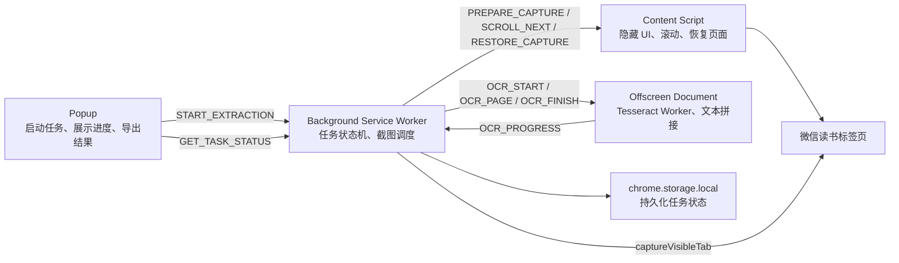

# WeRead Clipper 技术设计文档

版本：`2.0.0`  
更新时间：2026-06-01

关联文档：

- [`README.md`](README.md)：文档中心；
- [`prd.md`](prd.md)：产品需求；
- [`implementation-log.md`](implementation-log.md)：实施过程。

## 1. 设计目标

在 Chrome Manifest V3 约束下，实现微信读书单章文本的自动截图、本地 OCR、去重拼接和
导出。核心设计要求：

- 不依赖正文 DOM 是否可访问；
- 不依赖 popup 持续打开；
- OCR 在本地执行；
- 截图逐屏处理，控制内存峰值；
- 识别失败时优先保留文本，不静默丢失内容。

## 2. 系统架构



## 3. 模块设计

### 3.1 Popup

文件：

- `popup.html`
- `popup.js`

职责：

- 启动当前章节提取；
- 每秒查询任务状态；
- 接收 `TASK_UPDATED` 即时通知；
- 展示进度、书名、章节名、屏数、字数和人工校对接缝数量；
- 复制格式化文本；
- 请求 content script 打开页面内预览；
- 使用 `chrome.downloads.download` 导出 UTF-8 TXT。

Popup 只负责交互，不持有截图和 OCR Worker。

### 3.2 Background Service Worker

文件：`background.js`

职责：

- 校验当前标签页是否为 `https://weread.qq.com/web/reader/*`；
- 持久化任务状态；
- 创建 Offscreen Document；
- 调用 `chrome.tabs.captureVisibleTab`；
- 串行驱动截图、OCR、滚动和恢复流程；
- 转发 OCR 进度；
- 检测 service worker 重启后遗留的运行态，尝试恢复原页面并重置 OCR 会话；
- 处理异常和安全上限。

关键常量：

| 常量 | 值 | 说明 |
| --- | --- | --- |
| `MAX_SCREENS` | `80` | 防止触底判断失效后无限循环。 |
| `CAPTURE_DELAY_MS` | `650` | 滚动后等待页面稳定。 |
| `TASK_KEY` | `wereadClipperTask` | `chrome.storage.local` 中的任务键。 |

### 3.3 Content Script

文件：

- `content.js`
- `content.css`

职责：

- 读取书名和章节标题；
- 识别实际滚动容器；
- 隐藏已知工具栏和较小的 `fixed`、`sticky` 浮层；
- 保存和恢复原始滚动位置；
- 按视口高度 `78%` 逐屏滚动；
- 检测是否触底；
- 提供复制兜底和页面内 OCR 文本预览。

### 3.4 Offscreen OCR

文件：

- `offscreen.html`
- `offscreen.js`

职责：

- 初始化并复用 Tesseract Worker；
- 识别单张 Base64 PNG 截图；
- 将 OCR 文本交给 `text-stitch.js`；
- 仅保留累计文本和统计信息；
- 上报 OCR 进度；
- 在测试结束或异常后终止 Worker。

Tesseract 初始化：

```javascript
Tesseract.createWorker('chi_sim', 1, {
  workerPath: chrome.runtime.getURL('vendor/tesseract/worker.min.js'),
  corePath: chrome.runtime.getURL('vendor/tesseract/core'),
  langPath: chrome.runtime.getURL('vendor/tesseract/lang'),
  workerBlobURL: false,
  gzip: true,
});
```

### 3.5 文本拼接算法

文件：`text-stitch.js`

默认配置：

```javascript
{
  maxOverlap: 150,
  minOverlap: 10,
  similarityThreshold: 0.85,
  gapMarker: '\n\n[可能存在断层，需人工校对]\n\n',
}
```

处理步骤：

1. 清理 OCR 多余空白；
2. 对上一段尾部和下一段头部只保留中文字符；
3. 在 `10` 到 `150` 字符范围内遍历候选重叠长度；
4. 使用 Levenshtein 编辑距离计算相似度；
5. 优先选择相似度最高的接缝，长度仅作为次级条件；
6. 删除下一屏重叠区域和尾随标点；
7. 无可靠接缝时插入人工校对标识。

## 4. 核心工作流

### 4.1 准备阶段

1. Popup 发送 `START_EXTRACTION`。
2. Service worker 校验目标标签页。
3. Service worker 保存 `running/preparing` 状态。
4. Content script 执行 `PREPARE_CAPTURE`：
   - 定位滚动容器；
   - 保存原始位置；
   - 隐藏浮层；
   - 滚动到顶部；
   - 返回书名、章节名和 `atBottom`。
5. Offscreen 页面执行 `OCR_START`。

### 4.2 截图与识别循环

1. Service worker 检查目标标签页及其 Chrome 窗口仍在前台。
2. 调用 `captureVisibleTab` 获取 PNG Base64。
3. 将单张图片发送到 Offscreen 页面执行 `OCR_PAGE`。
4. Offscreen 页面完成 OCR、拼接和统计。
5. Service worker 不再保存该截图字符串。
6. 若当前屏已经是底部屏，则退出。
7. 否则请求 `SCROLL_NEXT` 并等待 `650ms`。

### 4.3 收尾阶段

1. Offscreen 页面执行 `OCR_FINISH`，返回累计文本。
2. Service worker 保存 `completed` 状态。
3. `finally` 块发送 `RESTORE_CAPTURE`。
4. Popup 再次打开时从 `chrome.storage.local` 恢复结果。

## 5. 消息协议

### 5.1 Popup 到 Background

| 消息 | 作用 |
| --- | --- |
| `START_EXTRACTION` | 启动任务。 |
| `GET_TASK_STATUS` | 查询持久化任务状态。 |

### 5.2 Background 到 Content Script

| 消息 | 作用 |
| --- | --- |
| `PREPARE_CAPTURE` | 隐藏 UI、保存位置、滚动到顶部。 |
| `SCROLL_NEXT` | 向下滚动并返回触底状态。 |
| `RESTORE_CAPTURE` | 恢复 UI 和原始滚动位置。 |

### 5.3 Background 到 Offscreen

| 消息 | 作用 |
| --- | --- |
| `OCR_START` | 新建 OCR 会话。 |
| `OCR_PAGE` | 识别单张截图并拼接。 |
| `OCR_FINISH` | 返回最终文本。 |
| `OCR_RESET` | 清理会话并终止 Worker。 |
| `OCR_WARMUP` | E2E 使用：验证模型和 WASM core 可本地加载。 |

### 5.4 Popup 到 Content Script

| 消息 | 作用 |
| --- | --- |
| `COPY_TO_CLIPBOARD` | Clipboard API 失败时使用页面上下文兜底复制。 |
| `SHOW_PREVIEW` | 在阅读页显示 OCR 文本浮层。 |

## 6. 任务状态

任务保存在 `chrome.storage.local.wereadClipperTask`：

```javascript
{
  status: 'idle' | 'running' | 'completed' | 'failed',
  phase: 'idle' | 'preparing' | 'capturing' | 'recognizing' | 'completed' | 'failed',
  tabId: null,
  windowId: null,
  message: '',
  pageNumber: 0,
  pagesProcessed: 0,
  totalPages: null,
  ocrProgress: 0,
  text: '',
  book: '',
  chapter: '',
  degradedJoins: 0,
  error: '',
  updatedAt: 0,
}
```

## 7. Manifest V3 与离线资产

### 7.1 权限

生产 manifest 使用：

- `activeTab`
- `clipboardWrite`
- `downloads`
- `offscreen`
- `storage`
- `tabs`

host permission：

```text
https://weread.qq.com/*
```

### 7.2 CSP

```text
script-src 'self' 'wasm-unsafe-eval'; object-src 'self'
```

### 7.3 本地 OCR 资产

```text
vendor/tesseract/
├── tesseract.min.js
├── worker.min.js
├── core/
│   ├── tesseract-core.wasm.js
│   ├── tesseract-core-simd.wasm.js
│   ├── tesseract-core-lstm.wasm.js
│   └── tesseract-core-simd-lstm.wasm.js
└── lang/
    └── chi_sim.traineddata.gz
```

## 8. 错误处理

- 非微信读书阅读页：拒绝启动。
- 已有任务运行中：拒绝重复启动。
- 新 service worker 读取到遗留运行态：尝试恢复原页面、重置 OCR 会话，标记任务失败并允许重新开始。
- 目标标签页或其 Chrome 窗口不再前台：中止任务。
- 页面控制失败：中止任务并恢复页面。
- OCR 初始化或识别失败：执行 `OCR_RESET`，保存失败状态。
- 超过 `80` 屏仍未触底：中止任务，提示检查页面滚动。
- 接缝无法可靠匹配：保留文本并插入人工校对标识。

## 9. 测试策略

| 层级 | 文件 | 验证目标 |
| --- | --- | --- |
| 算法单测 | `tests/text-stitch.test.js` | Levenshtein、容错拼接、断层降级。 |
| 页面控制单测 | `tests/content.test.js` | UI 隐藏、滚动、恢复、预览和复制。 |
| 调度单测 | `tests/background.test.js` | 截图循环、OCR 消息流和状态持久化。 |
| 资产单测 | `tests/assets.test.js` | OCR 发布资产完整性。 |
| 扩展 E2E | `tests/e2e/extension.spec.js` | MV3 service worker、截图、Offscreen、模型热启动和 Popup 展示。 |

运行：

```bash
npm run test:all
```

## 10. 当前限制

- 截图依赖目标标签页及其 Chrome 窗口处于前台。
- OCR 可能产生错字，需要人工校对。
- 图片、公式、复杂代码块和特殊排版识别效果未充分验证。
- 真实微信读书完整章节和 `50+` 屏性能仍需发布前人工验收。
